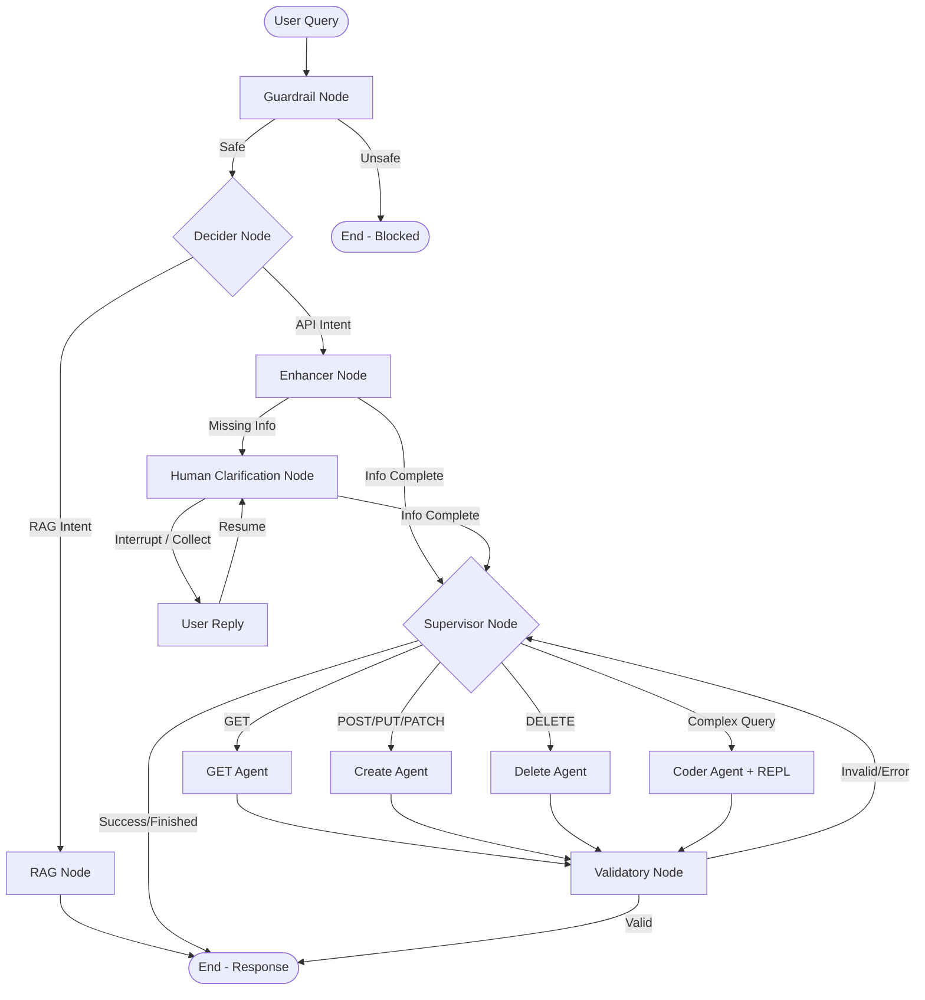

# Smart Client — RAG Backend
A **production-ready** Retrieval-Augmented Generation (RAG) backend built with **Clean Architecture + Repository Pattern**.
## 🏗️ Architecture
```
app/
├── domain/                    # Pure business logic — no external dependencies
│   ├── entities/              # Document, Chunk, Conversation, Message
│   ├── repositories/          # Abstract interfaces (ports)
│   └── services/              # Domain business rules
├── application/               # Use-case orchestration layer
│   ├── dto/                   # Data Transfer Objects (Pydantic v2)
│   └── use_cases/             # Upload, Process, Search, Chat, CRUD
├── infrastructure/            # Concrete implementations (adapters)
│   ├── db/                    # SQLAlchemy models, async repos, pgvector
│   ├── parsing/               # Docling PDF/DOCX parser with image description
│   ├── chunking/              # Title-aware chunking (LangChain splitters)
│   ├── embeddings/            # OpenAI batch embedding service
│   └── llm/                   # OpenAI chat, multi-query, Cohere reranking
└── interfaces/
    └── api/                   # FastAPI routes, schemas, AnyDI container
        ├── dependencies/      # DI container (AnyDI) + FastAPI providers
        ├── routes/            # documents, search, conversations, system
        └── schemas/           # Pydantic v2 request/response schemas
```
## 🚀 Tech Stack
| Layer | Technology |
|---|---|
| Web Framework | FastAPI (async) |
| Database | PostgreSQL + pgvector |
| ORM | SQLAlchemy (async) |
| Migrations | Alembic |
| DI | AnyDI |
| LLM | OpenAI GPT-4o (via LangChain) |
| Embeddings | OpenAI text-embedding-3-large |
| Reranking | Cohere Rerank v3 |
| Document Parsing | Docling |
| Image Description | OpenAI GPT-4o Vision |
| Telemetry | Azure Monitor + OpenTelemetry |
| Package Manager | uv |
## ⚡ RAG Pipeline
```
Upload → Parse (Docling) → Chunk by Title → Embed (OpenAI) → Store (pgvector)
Query → Multi-Query Expansion → Vector Search → RRF Fusion → Cohere Rerank → LLM Response
```
## 📦 Setup
### 1. Install dependencies
```bash
uv sync
```
### 2. Configure environment
```bash
cp .env.example .env
# Fill in OPENAI_API_KEY, COHERE_API_KEY, DATABASE_URL, etc.
```
### 3. Setup PostgreSQL with pgvector
```sql
CREATE DATABASE smart_client_db;
\c smart_client_db
CREATE EXTENSION IF NOT EXISTS vector;
CREATE EXTENSION IF NOT EXISTS pg_trgm;
```
### 4. Run migrations
```bash
uv run alembic upgrade head
```
### 5. Start the server
```bash
uv run python main.py
# or
uv run uvicorn main:app --host 0.0.0.0 --port 8000 --reload
```
## 📚 API Endpoints
### Documents
| Method | Endpoint | Description |
|--------|----------|-------------|
| `POST` | `/api/v1/documents/upload` | Upload PDF/DOCX |
| `POST` | `/api/v1/documents/{id}/process` | Parse → Chunk → Embed |
| `POST` | `/api/v1/documents/{id}/reprocess` | Force re-embed |
| `GET` | `/api/v1/documents` | List (paginated, filterable) |
| `GET` | `/api/v1/documents/{id}` | Get single document |
| `PUT` | `/api/v1/documents/{id}` | Update metadata |
| `DELETE` | `/api/v1/documents/{id}` | Delete (cascades chunks) |
| `GET` | `/api/v1/documents/{id}/chunks` | Get document chunks |
### Search
| Method | Endpoint | Description |
|--------|----------|-------------|
| `POST` | `/api/v1/search` | Semantic search (multi-query + rerank) |
| `POST` | `/api/v1/search/hybrid` | Hybrid search (vector + BM25 + rerank) |
### Conversations
| Method | Endpoint | Description |
|--------|----------|-------------|
| `POST` | `/api/v1/conversations` | Create conversation |
| `GET` | `/api/v1/conversations` | List conversations |
| `DELETE` | `/api/v1/conversations/{id}` | Delete conversation |
| `GET` | `/api/v1/conversations/{id}/messages` | Get messages |
| `POST` | `/api/v1/conversations/{id}/chat` | Chat (RAG) |
### System
| Method | Endpoint | Description |
|--------|----------|-------------|
| `GET` | `/api/v1/health` | Health check |
| `GET` | `/api/v1/config` | System configuration |
## 🧪 API Docs
- Swagger UI: http://localhost:8000/docs
- ReDoc: http://localhost:8000/redoc
## 🔧 DI Scopes (AnyDI)
| Service | Scope |
|---------|-------|
| LLM, Embedder, Reranker, Parser | Singleton |
| DB Engine + Session Factory | Singleton |
| DB Session | Scoped (per request) |
| Repositories, Use Cases | Transient |

## 🤖 Smart API Agent (LangGraph Orchestrator)
The repository includes a **Smart API Agent** that dynamically orchestrates API calls and queries based on tenant-specific API specifications and profile data. 

With this system, a tenant can register their API definitions (endpoints, query/path parameters, request bodies, descriptions) and product knowledge. The agent will then interact with users in natural language, automatically determining which API tool to invoke, resolving missing parameters via **Human-in-the-Loop** clarifications, executing complex multi-step data aggregation with a **Python REPL Coder Agent**, and validating the final response before delivering it.

### 🏗️ Agentic Architecture & Topology
The agent is built using **LangGraph** to manage state, routing, and interrupts. 



#### Node Directory & Descriptions
- **Guardrail (`guardrail_node`)**: Inspects query safety, scanning for injection or exfiltration attempts. Blocks immediately if a hazard is detected.
- **Decider (`decider_node`)**: Evaluates user query to distinguish between generic information inquiries (routed to `rag`) and transactional API requests (routed to `enhancer`).
- **RAG (`rag_node`)**: First attempts a vector and hybrid search on indexed company documents using multi-query expansion and Cohere reranking. It falls back to the tenant's free-text company information if no files are indexed.
- **Enhancer (`enhancer_node`)**: Checks the query against registered API specifications. Identifies missing fields required by the API, schedules path/query/body parameter collection, and maps entity name-to-ID lookups.
- **Human Clarification (`human_clarification_node`)**: Uses a LangGraph `interrupt_before` checkpoint. It halts execution, prompts the client for missing fields, and resumes once the user submits the needed values.
- **Supervisor (`supervisor_node`)**: Coordinates step-by-step routing to specialized ReAct agents and acts as a retry limiter (default: 3 retries).
- **Specialist ReAct Agents**:
  - **GET Agent (`get_agent_node`)**: Binds and runs dynamically generated GET tools for read operations.
  - **CREATE Agent (`create_agent_node`)**: Binds and runs POST, PUT, and PATCH tools for write/update operations.
  - **DELETE Agent (`delete_agent_node`)**: Binds and runs DELETE tools.
  - **Coder Agent (`coder_agent_node`)**: Outfitted with a Python REPL tool and all dynamic API tools. It handles complex, analytical questions (e.g., *"How many cases were created in September grouped by severity?"*) by writing and executing scripts over API responses.
- **Validatory (`validatory_node`)**: Reviews the output of the specialist agent against the user's original goal. If it finds missing data or HTTP errors, it generates validation feedback and routes back to the supervisor for correction.

---

### 💾 Session Checkpointing & Persistence
In production (`app/`), the graph state is saved using **`AsyncPostgresSaver`** (from `langgraph-checkpoint-postgres`) backed by a shared PostgreSQL connection pool. This guarantees:
- **Durable Persistence**: Sessions survive application restarts.
- **Human-in-the-Loop Resumes**: Execution can pause, yield control to the client over an HTTP stream, and resume later via another POST request.
- **Multi-Tenant Session Isolation**: Sessions are separated cleanly by `session_id` (mapped to `thread_id` inside LangGraph).
- **Horizontal Scalability**: Stateless API nodes can resume any session by reading the state from the centralized Postgres database.

> [!NOTE]
> A standalone, in-memory variant of the agent graph is located in the [sample](file:///c:/Users/VikasThakkar/source/repos/smart-client/sample) directory. It is useful for isolated development and fast local verification without Postgres dependencies.

---

### 🔌 Agent API Endpoints
All agent endpoints are routed under `/api/v1/agent`:

| Method | Endpoint | Description |
|:---|:---|:---|
| `POST` | `/api/v1/agent/register` | Register tenant details, free-text company info, and an array of API specs. Returns an embeddable `<script>` tag. |
| `DELETE` | `/api/v1/agent/register/{tenant_id}` | Deregisters the tenant and deletes their metadata and specs. |
| `GET` | `/api/v1/agent/tenants/{user_id}` | Lists all registered tenant IDs associated with a specific user. |
| `POST` | `/api/v1/agent/chat/{session_id}` | Initiates/continues a chat session. Streams events as Server-Sent Events (SSE). |
| `POST` | `/api/v1/agent/resume/{session_id}` | Resumes a paused session using the user's response to a clarification query. |
| `GET` | `/api/v1/agent/session/{session_id}` | Inspects the current state, collected fields, and next steps for debugging. |

#### SSE Event Payload Formats
During chat and resume sessions, the server streams back Server-Sent Events with the following schema:
- **Token Stream**: `data: {"type": "token", "content": "..."}`
- **Active Node Progress**: `data: {"type": "node_start", "node": "enhancer"}`
- **HITL Pause Alert**: `data: {"type": "clarification_needed", "content": "Please provide the severity level."}`
- **Completion Marker**: `data: {"type": "done"}`
- **Error Alert**: `data: {"type": "error", "detail": "..."}`

---

### 🚀 Example Client & Server Usage
A fully functional end-to-end demo is available in the [sample](file:///c:/Users/VikasThakkar/source/repos/smart-client/sample) folder.

#### 1. Start the Server
You can run the full Clean Architecture backend:
```bash
uv run python main.py
```
Or, start the standalone in-memory sample server:
```bash
cd sample
uv run python server.py
```

#### 2. Run the Example Usage Client
In a separate terminal, execute the demo script:
```bash
uv run python sample/example_usage.py
```

#### 3. Client Implementation Walkthrough
The client in [example_usage.py](file:///c:/Users/VikasThakkar/source/repos/smart-client/sample/example_usage.py) showcases the entire lifecycle of the agent:

1. **Tenant Registration**: Registers a company profile and maps 11 endpoints to JSONPlaceholder (posts, comments, users, albums, etc.).
2. **Knowledge Query (RAG)**: Resolves general questions like *"What is this API used for?"*.
3. **API Execution (GET)**: Requests specific items: *"Show me all posts created by user 1."*.
4. **Analytical Request (Coder)**: Resolves complex groupings: *"How many posts were created by each user?"*.
5. **Human-in-the-Loop Flow**:
   - Sends: *"Create a new post about a network outage."*
   - Receives: `clarification_needed` event asking for missing parameters (`title`, `body`, `userId`).
   - Responds via `/resume` with: *"Title is 'Network Issue', body is 'System outage in region', userId is 1."*
   - Agent dynamically collects the details, builds the JSON body, makes the POST call, and streams back the success confirmation.
